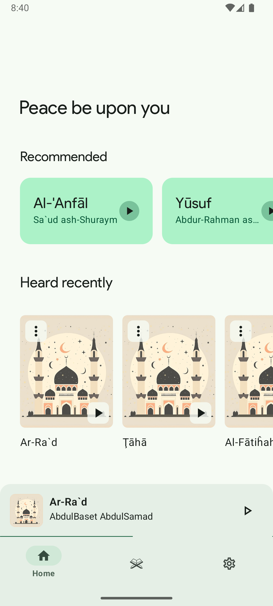

# Mostaqem (Android)

> Still in development but soon will be on beta

### Screenshots (but it's not over yet):

    
    
    

### Credits

* Omar Sabra | Backend Engineer
* Me | Android Developer