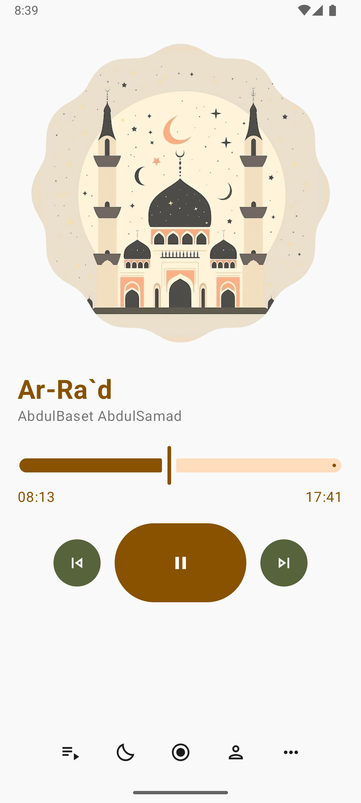

# Mostaqem (Android)
## Download [Google Play](https://play.google.com/store/apps/details?id=com.mostaqem) Android 8.0 or more

    
    
    
    

### Features
- Localization (English , Arabic , Soon more will be added)
- Reciter Control (Choose default reciter - change current surah reciter)
- Recitations
- Recommendations
- Sleep Mode
- Reading
- Share Ayah 
- Offline Mode (download and be able to listen offline)

### Credits

* Omar Sabra | Backend Engineer
* Me | Android Developer
* Islam Khalil | Web Developer

> You can also get the [Desktop](https://github.com/Mostaqem/mostaqem_desktop) version
